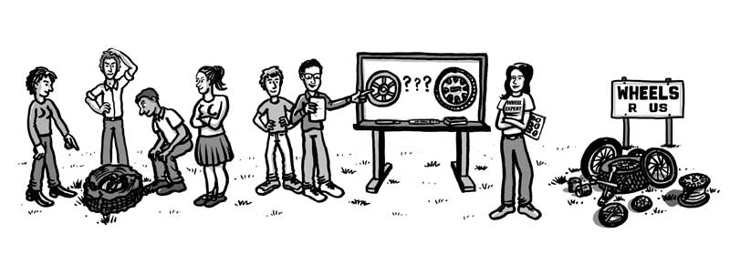

# Don’t reinvent the wheel

When you encounter a challenging problem, you may be very tempted to immediately get hands-on and solve the problem in your own way without doing any research, but this may not be the best approach to the problem. For example, if you did not know the best shape for wheels for a car or bike is a circle, then you instantly went to build different shapes of wheels like triangular, square, and hexagon wheels, you would spend a lot of time to think about the design, implement the design, and test the design. On the other hand, if you learned that your predecessor of wheel designers had already spent the extensive amount of time that you could spend into those head-banging processes and figured out the current best generic solution for this problem, then you don’t have to go through the same process again which will save you significant amounts of time and it may also get a better result then reinvent the wheel entirely from scratch by yourself. This is the idea of the design pattern.

# Design patterns exist everywhere in our lives

In fact, design pattern exists everywhere in our lives. From a design of a T-shirt should have different sizes (S, M, L, XL)  to a computer should have an operating system and CPU, from ATMs should spit out your card after your translation is done to there should be 8 color-coded wires for an ethernet cable, as what we can see there, all of these are examples of design patterns that professional in different industries created to in sure the quality of the solution of the problem which will improve people’s experience rather than using poor or flawed solutions that will result in bad consequences. However, one thing worth noting is that a design pattern is not the specific and complete solution to the problem. For example, engineers agreed that an ethernet cable should have 8 color-coded wires as a good practice for the industry, but whether your cable built with this pattern can get you sufficient internet speed through the cable may not be solved by this design pattern. Thus, it is clear that a design pattern is a reusable blueprint, template, or generic solution that the predecessors who attempted to solve the problem figured out and agreed on.

# Design patterns in software engineering 

Since we mentioned earlier that design patterns exist everywhere in our lives, then design patterns must appear in the world of software engineering as well! Indeed, there are so many design patterns in software engineering. For example, one design pattern that I used in my codes is the factory pattern, which is one of the most used design patterns. It tries to solve the problem of creating objects and by using this pattern we are able to hide the underlying logic or the base class that creates the objects. For instance, I created a library system using Java that I have Person as the abstract class, and Student and Staff are the subclasses of Person. In the subclasses I declared the abstract factory method to produce Person objects in the need and form of the subclasses in which the implementation of the Person class is hidden. There are also other design patterns I used currently when building the web applications like Model-View-Controller (MVC) design pattern which separates the user interface, controller (what should be presented to the user interface), and model. This design pattern applies to almost all web application building.

In conclusion, a design pattern is the master key when you begin to attempt problems and it can benefit you by saving a lot of time and helping you to approach the correct solution.

