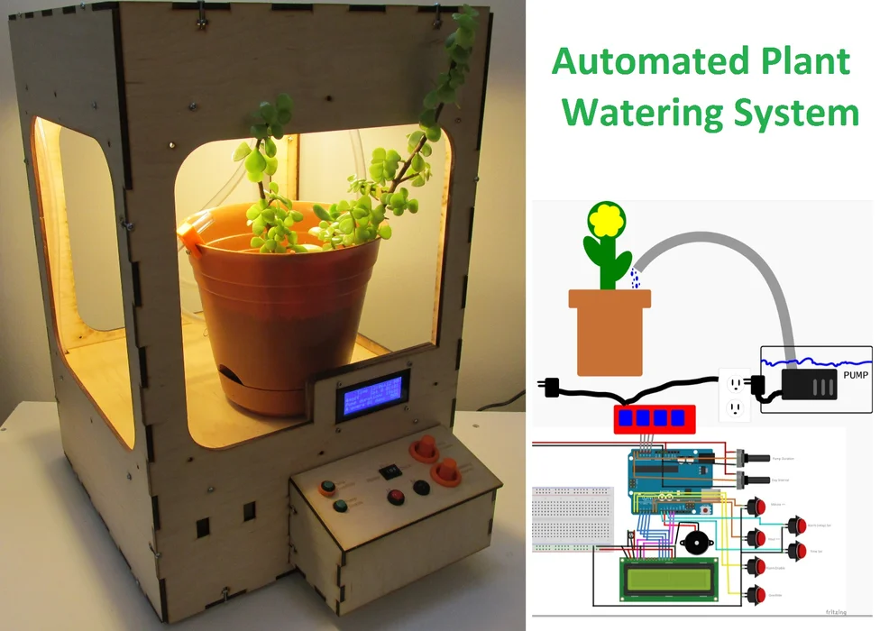

## Where the Journey Began

When I first started middle school in Hawaii, I did not consider in the future I would do anything with coding or even computers at all, because back in China, most of the teachers, students, and parents think that a computer is mostly an entertainment tool that can cause negative effects on students' study performance. Thus, based on my limited experience, I have a bias that, in terms of students, computers are for the bad kids who don’t want to study but just play video games. Then, coding is only equivalent to creating video games. Therefore, I wasn’t interested in studying computer skills or coding.

(This is a project that is similar to what I had done: )

<figure>
  
</figure>

Later, my view got turned. Back in 8th Grade, I was interested in math and physics. In my math and physics classes, the teachers wanted to do a unit in programming. In my math class, the teacher introduced me to [Scratch](https://scratch.mit.edu/about), “a coding language with a simple visual interface that allows young people to create digital stories, games, and animations” as noted on the website. Scratch made me realize that I build wonderful things by myself without any other resources except my own creativity and a computer. But Scratch is still a child's play. I found the hands-on experience is interesting but the outcomes are mostly just a simple game that is not very meaningful and useful. Fortunately, at the same time, I encountered real programming languages in a self-study class called “Life-long Learning” and in my physics class. In the “Life-long Learning” class, a school staff member was my mentor and luckily, he was working on building the solar system and aquaponic system for the school which made him self-taught programming language and hardware stuff. He was mainly using Arduino and single-chip to build and control the system. Meanwhile, I was getting in touch with Arduino as well in my physics class, so that was the first time I could use codes to build hands-on things and I found programming meaningful and useful rather than for entertainment only, especially later I was able involved in the school project like building a system with an LCD display to monitor the plants’ conditions. 

 
 
In the same year, in my physics class, we were exploring autonomous vehicles, and AlphaGo just announced its advent to the world by defeating multiple world-class Go players. This completely changed my mind about the potential of computers again and opened my eyes to the path of artificial intelligence. I was a big fan of Chinese chess (also known as Xiangqi), with a game tree complexity of approximately 10^150 whereas international chess has a game tree complexity of approximately 10^123, but Go has a complexity of about 10^360 (for more details, see [game complexity](https://en.wikipedia.org/wiki/Game_complexity#Complexities_of_some_well-known_games). At that time, I was learning how to play Go in my “Life-long Learning” class, and this news was an extreme shock to me because Go is one of the most complex games in the world as we see the exponent in the game tree complexity is much larger than other games. This means that once Go, the last defender of human logical calculations and wisdom, got overcome by the computer, then theoretically there is no way for humans to defeat the computers in such games or in calculations wise even though humans learned this game from thousands of years ago and obtained so many experiences and knowledge. Meanwhile, in my physics class,I studied that based on mathematical modeling and simulations, autonomous vehicles have much lower rates of accidents compared with the current human accident rate and there are also many other benefits such as freeing the time and energy from driving, eliminating traffic congestion, parking spaces issues, etc. In addition, my stepfather was a firefighter and he mentioned how AI may reduce the risks for firefighters during fire incidents, such as helping in searching for trapped people, finding safe paths, and combining with robotics, the firefighters may have help on carrying heavy equipment and people in the fire scenes which will greatly reduce their chance of injuries and deaths. Since then, I see the value in computers, in software engineering, and especially in the field of AI. It is one of the most powerful world-changing tools in the 21st century, and most likely it is the most powerful tool than anything else. It is not only for entertainment in the virtual world. It can bring meaningful things to people in real life and it may even give people hope and save lives in certain situations. That’s the moment and reason, I wanted to study computer science.

## Moving Forward

I chose to major in computer science and now I am a junior in the data science track which is the track that is more related to studying AI. Since I have only taken one class related to AI - ICS 235 intro to machine learning methods, I would like to explore further in the field of machine learning by taking related courses, accomplishing related projects, and hopefully, attain one or more intern/work experiences related to AI or data science. Through these processes, I hope I can learn different models in machine learning and get a deeper understanding of the application of AI/machine learning. Currently, I am interested in the field of computer vision and deep learning which are known as the “eyes” and “brain” for AI. By acquiring such knowledge, I hope I can participate in this world-changing trend, a trend that will make the world a better place.

