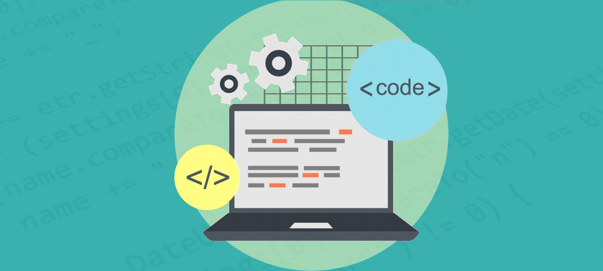

# Go Out of Console, Web Application Development, and Beyond

Although I had done programming by using different languages, I had not yet really jumped out of the console and developed a complete software application that involved the front-end, web, database, and most importantly developing applications in a team using team/project management. This is the first time I have dived into the world of web development and software engineering in this class ICS 314 - Software Engineering I. Even though the technology stack for this class is web development and it is in fact a valuable skill for software engineers to have, the most crucial takeaway from this class is those fundamental software engineering concepts like agile project management and coding standards.

# Agile Project Management

Agile project management is an iterative method of carrying out a project over the course of its life. Multiple iterations or incremental steps toward the completion of a project make up iterative or agile life cycles. Since the benefit of iteration is that you may alter as you go along rather than following a linear path, iterative approaches are widely employed in software development projects to promote mobility and adaptability (APM). In ICS 314, we specifically used one type of agile project management called “issue-driven project management” via GitHub. The idea of issue-driven project management is that we need to divide our tasks into different small issues that need to be resolved. By resolving these issues, we will be able to successfully accomplish the project. The benefits of issue-driven project management are maintaining project stability and efficiency throughout the project lifecycle; identifying and addressing “obstacles that can hinder project success and/or block the project team from achieving its goals. These obstacles can include such factors as differences of opinion, situations to be investigated, emerging or unanticipated responsibilities” (CDC). In addition, in our final project - study partner, we divided the project into 3 milestone projects. Each milestone indicates different levels of completeness from drafting to prototype to the finished product. Then, in each milestone, we listed different issues that we need to work on at the current level and divide the tasks among each team member. Although this is the first time for my team members and me to explore agile project management, we had great success using it and we were able to accomplish our final project very well with no things like huge differences of opinion and unanticipated responsibilities. Despite the fact that we used it only for web development. I think this is a great project management method to use in any form of programming project and even outside of doing programming projects.

# Coding Standards

Another great fundamental software engineering concept that I take away from this class is coding standards. Coding standards are the rules that good software development organizations developed to enable their programmers to maintain a well-defined and standard style of coding. Even though, I did experience using code standards for other languages like Java, C, and python (for example, naming convention, indentation, class/function standard, commenting, Javadoc), it wasn’t very strict as what we experienced with Javascript and HTML in this class. It was more like a recommendation thing to do if it does not cause syntax errors or crushes. In ICS 314, we must follow the code standard of Eslint which is a static code analysis tool and a plugin in our IDE (integrated development environment) IntelliJ IDEA. Eslint has a very strict code standard. For example, using a double quote for strings is correct in syntax and it will not cause any error that will crush the program, Eslint will popup errors to notify you to fix it. There are many other things that this that you don’t have to do it for the code to run properly but Eslint is strictly required, such as you must add a space after a curly bracket, you must add a new line at the end of a file, and you must use template string to concatenate the strings with variables rather than using a plus sign. All of these things are very annoying especially when you are not familiar with this coding standard, but it does come with the benefit of maintaining better readability which helped me numerous times to save time on identifying bugs in my codes. Furthermore, it also helped me to be able to read my teammates’ codes and vice versa when we were working on team projects. Thus, the efforts on maintaining code style and code standards are well worth it.

# Concluding Remarks

In summary, these fundamental software engineering concepts that I learned in ICS 314 are essential stepping-stones on my path to becoming a professional software engineer. Although it was a frustrating and challenging process of learning and implementing these concepts, being able to go out of the comfort zone - console, open the door and step into the world of web application development, teamworking, and software engineering was a great adventure. This experience and these concepts will help to further on the journey of software engineering.

_**References**_
APM. “What Is Agile Project Management?” APM, https://www.apm.org.uk/resources/find-a-resource/agile-project-management/.  
CDC. “PMG.” Centers for Disease Control and Prevention, Centers for Disease Control and Prevention, https://www2a.cdc.gov/cdcup/library/pmg/other/isu_description.htm.  

