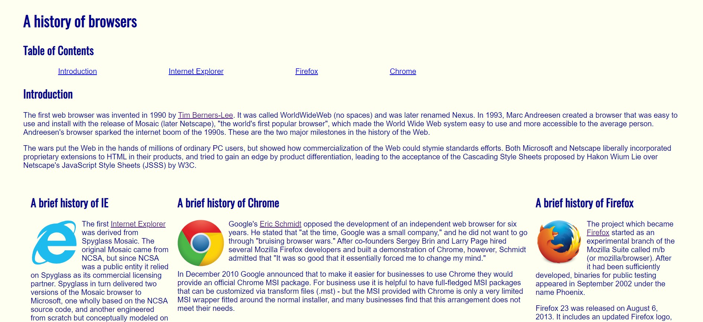
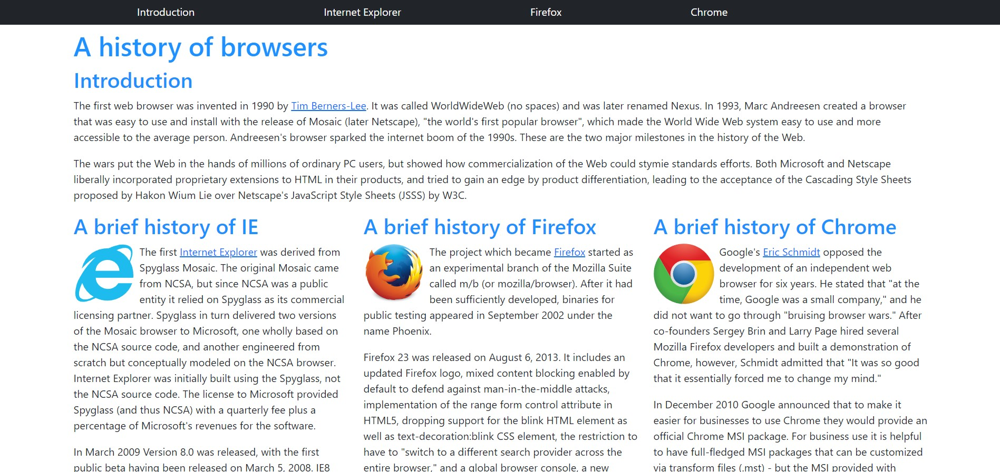
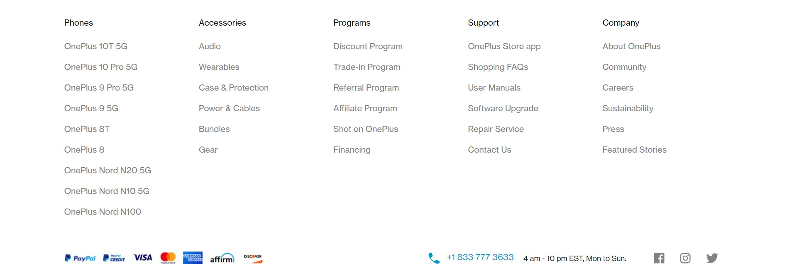
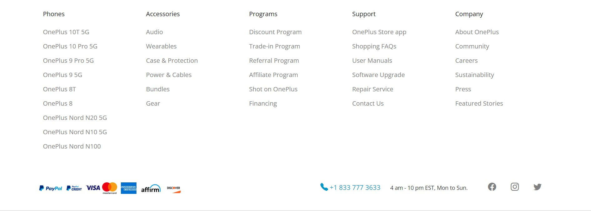

# Starting Simple with Raw HTML & CSS

I had not code with any front-end languages like HTML and CSS before, so exploring with raw HTML and CSS is a completely new experience and feel. I had built websites with web design/building tools like Weebly and Wix before, but starting from a complete scratch without any templates and features to quickly select pre-made items and move them around is very different. The benefit of using raw HTML and CSS is that you can do whatever you want. You can do many custom things that you aren’t not able to do in a web builder. Although raw HTML and CSS are powerful, there are some problems that occur during the process of website building. For example, one problem is that building a website especially to make it look good is very time consuming. Most of the time, you have already spent a lot of time in building the website, but it still looks very unprofessional, plain, or even unorganized. I had experienced spending a lot of time to simply doing margin, paddling, and alignments to make the items organize.

# Stepping into Bootstrap 5

     

 
UI frameworks like Bootstrap 5 are the solution to this problem. When I first started to use Bootstrap, I feel like it’s a lifesaver, because simply spending a few minutes of adding a several classes like `container` and `justify-content-end` is worthy the 20 to 30 minutes in raw HTML and CSS to create my own wrapper classes and doing micro-tuning to adjust the classes. In addition, the websites appear to be much more organized and professional. For example, the following images are a comparison of the same website that I built. One is built with raw HTML and CSS, and another one is built with Bootstrap 5.

  

    

      

        <strong>Raw HTML and CSS Version:</strong>
      

      

    

  

  

    

      

        <strong>Bootstrap 5 Version:</strong>
      

       

    

  

It’s clear that the Bootstrap 5 version looks much more interesting.

Lastly, I was able to use the power of Bootstrap 5 to recreate a professional website (Oneplus’s official website) which feels almost impossible for me to only use raw HTML and CSS especially in the same amount of time. 

  

    

      

        <strong>Original Oneplus Official Site:</strong>
      

        

        

    

  

  

    

      

         <strong>Recreation of Oneplus Official Site:</strong>
      

        

        

    

  

# Conclusion

I think raw HTML and CSS is still very powerful and you can do a lot of things using them. If you are an expert in the languages, you may be able to achieve the same result as using a UI framework, but compared with a UI framework, the return on investment is not as great as using the framework. In addition, for people who are new to the language, the features are kind of limited. Therefore, to reduce the time spent and frustrations and bring both beginners and experts to the next level in web design, I think it is definitely worthy for software engineers to learn at least one UI framework for web development.

