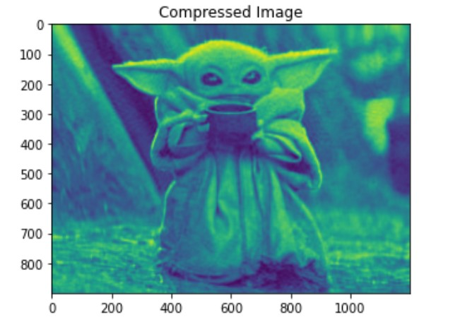
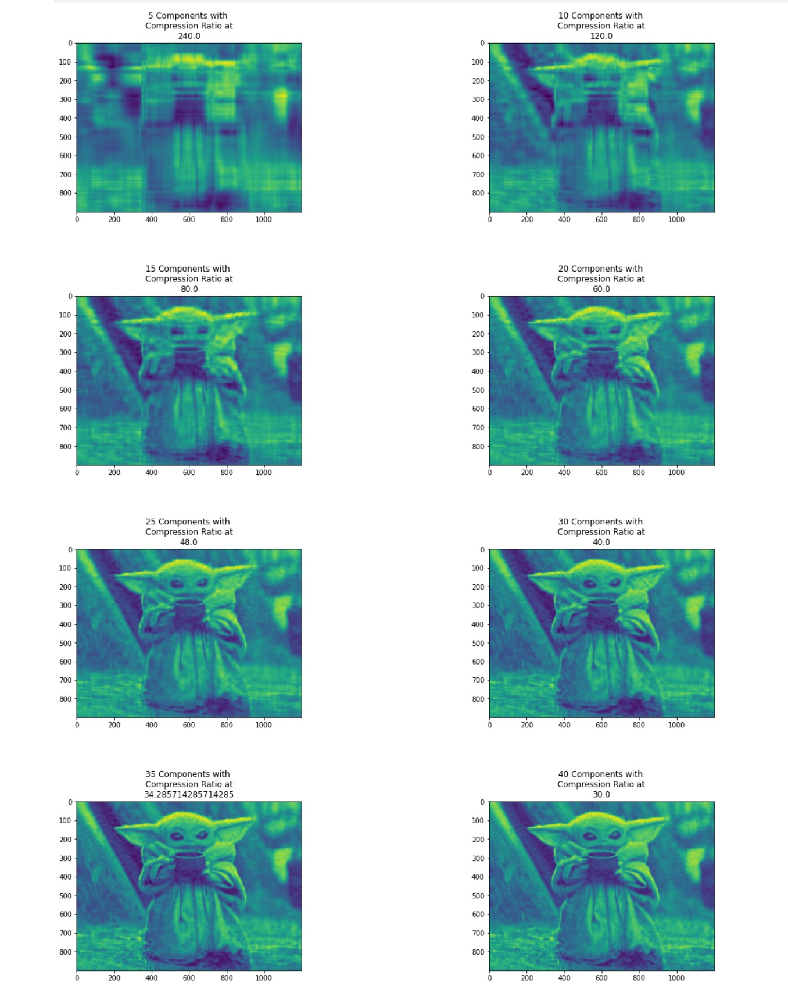

     
In this project, I use Principal Component Analysis to compress an image of baby yoda and we only have a single picture to compress. It denotes that we have n pixels of features and a single sample. If we wish to use PCA to effectively represent our data, we have an issue. In light of this, this method will treat the image as a sample by feature matrix, with each row being a sample and each column representing a feature. 

In this project, the space of images is referred to as the "original space," and the space of images after PCA decomposition is referred to as the "PCA space." The strategy we're doing is to only use a few components to represent our image in the PCA space. To maintain the visual quality, we want to choose the fewest possible components.

     
In order to use PCA, I converted the image into a numpy array which will make the image in a black and white form since we are only focus on the image quality rather than the color. After running a Principal Components Analysis on the image with 50 components to compress, we result a ratio of 24.0 between the size of the compressed image and the original image. The first compressed image as shown:

Then, I fine-tuned the compressed images by using different number of components. In order to evaluate the impact of the number of components on image quality and visually inspect the compressed images, I plotted the result of compression image for a varying number of components from 5 to 40 with a step of 5. In this way, each subplot represents an image for a given number of components (see figure below).

     
  
     
By accomplished this project, I learned how can machine learning, specifically PCA decomposition, use in the field of image compression. In addition, I learned how to fine-tune the result of the model ran, and how to present the results of the model in a straightforward visual way.

You can learn more at source codes: [PCA Image Compression](https://github.com/ZianZengUH/PCA_compression).

