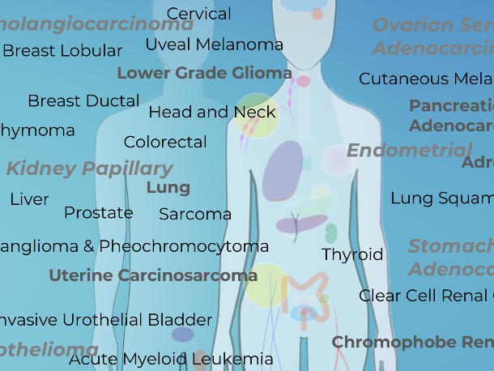
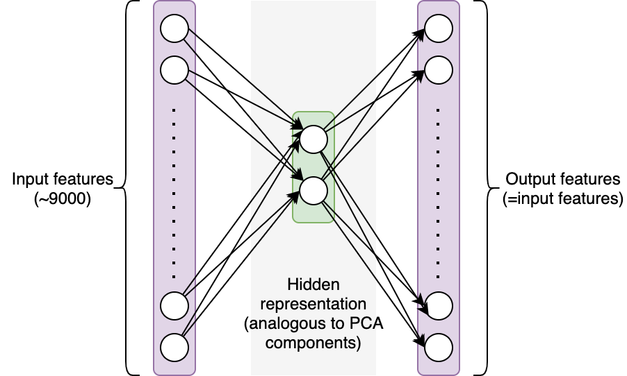

     
In this project, I analyzed a a gene expression dataset from the Cancer Genome Atlas (TCGA) Research Network, a landmark cancer genomics program, molecularly characterized over 20,000 primary cancer and matched normal samples spanning 33 cancer types. Data was downloaded from the UCI website: (https://archive.ics.uci.edu/ml/datasets/gene+expression+cancer+RNA-Seq).

Patients with various cancers (breast, lung, kidney, etc.) provided tumor samples, and the cells in the tissues were sequenced. The sequencing results can be displayed as a table after some data processing, where the rows represent our samples and the columns represent the frequency with which RNA from a certain gene was found (in other words, each column correspond to the expression level of a gene).

The goal of the project is to answer the folliowing questions:
- Can we distinguish between different cancer types by looking at the gene expression level of a tissue?
- Can we identify the different types of samples if we don't know how many types of cancer we have?

In fact, single-cell RNA sequencing has a direct application to this issue. Cancer patients' blood samples frequently contain a mixture of tumor cells and other cells (e.g. immune cells). Sorting through those is crucial if we want to understand the differences between healthy and malignant cells.

In this project, I tried to solve this unsupervised problems with neural network. To accomplish this, we will create a straightforward autoencoder to separate out 2 components from our features (similar to PCA components). An autoencoder network uses a set of features as input and makes predictions based on those same features. The network's architecture imposes restrictions that make it difficult to recover the initial values. In this instance, we'll employ a single hidden layer containing two neurons: In order to reconstruct the approximately 9000 feature values from the selected features as accurately as feasible, the network must first encode the information from those 9000 features into 2 values (see figure below). Intuitively, the hidden layer should encode significant information about our samples if the network is successful in reconstructing the original values.

In this project, I created a scatter plot of the data translated into the 2D space generated by the first two principle components using PCA on the scaled data. Each sample are colored using the class labels.

In addition, I trained a regression neural network with a 2-neuron hidden layer on the scaled data. I computed the hidden representation of each sample with N_samples-by-2 dimensional array and plotted the 2D representation of the data computed and color them by cluster label as the following graph.

     
     
For this project, I learned how to use a neural network to solve unsupervised problems, specifically Autoencoder network. Also, I learned how does Principal Component Analysis (PCA) can be used in helping generating the neural network.

You can learn more at: [autoencoder_network](https://github.com/ZianZengUH/autoencoder_for_TCGA).

