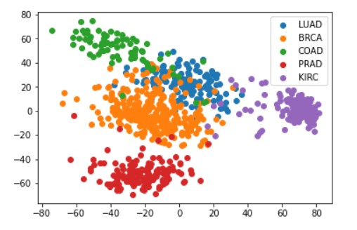
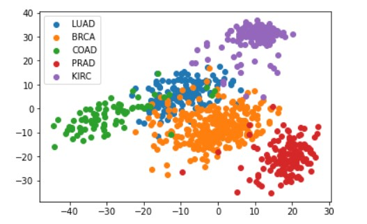

     
In this project, I analyzed a a gene expression dataset from the Cancer Genome Atlas (TCGA) Research Network, a landmark cancer genomics program, molecularly characterized over 20,000 primary cancer and matched normal samples spanning 33 cancer types. Data was downloaded from the UCI website: https://archive.ics.uci.edu/ml/datasets/gene+expression+cancer+RNA-Seq.

Patients with various cancers (breast, lung, kidney, etc.) provided tumor samples, and the cells in the tissues were sequenced. The sequencing results can be displayed as a table after some data processing, where the rows represent our samples and the columns represent the frequency with which RNA from a certain gene was found (in other words, each column correspond to the expression level of a gene).

The goal of the project is to answer the folliowing questions:
- Can we distinguish between different cancer types by looking at the gene expression level of a tissue?
- Can we identify the different types of samples if we don't know how many types of cancer we have?

In fact, single-cell RNA sequencing has a direct application to this issue. Cancer patients' blood samples frequently contain a mixture of tumor cells and other cells (e.g. immune cells). Sorting through those is crucial if we want to understand the differences between healthy and malignant cells.

     
     
For this project, I learned 

You can learn more at source codes: .
