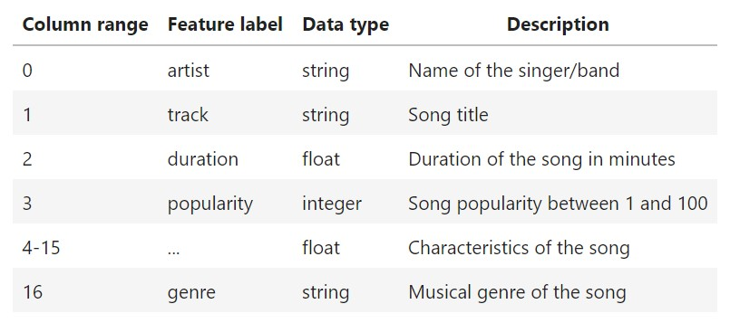
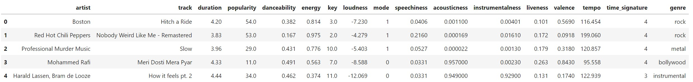
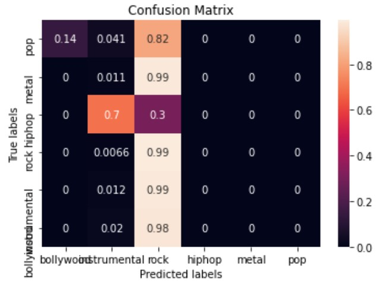

  
  

In this project, I analyzed a dataset to predict the musical genre of popular songs based on the songs characteristics. The characteristics are the followings: artist, track, duration, popularity, danceability, energy, key, loudness, mode, speechiness, acousticness, instrumentalness, liveness, valence, tempo, time signature. The dataset given was cleaned and filtered for the purpose of focusing building the machine learning models, so the dataset only contains the above features and the targeted feature genre to test the accuracy of the model. However, the given dataset still need to go through the process of encoding, normalization, and spliting the data set in order to build the mahcine learning model. 

The chosen model for predicting the genre was linear support-vector machines(SVM) classifier, because the problem that we dealed with was a classifiing problem. After training the model, I compute accurcy of the model and both for the train and test accuracy are not great which is arond 50%. Thus, I optimized the hyperparameters C, gamma, and the kernel, using a randomized search approach with 3-fold cross-validation to increase the performent of the model. At the end, I compute the confusion matrix for the best model and displayed in heat map format. 

     
For this project, I learned how does a supervised linear model can work with classifing type of problem to make accurte predictions. In addition, I learned about how to further process data such as spliting, encoding and normalization, to make the dataset fit into the model, especially using what type of process methods are essential. For example, in this case, encode the data with its original order through normalization is the the right choice and other types of encoding such as ordinal encoding and one hot encoding are bad idea. Because for ordinal encoding, it implicitly indicate the order of artist or track name which may affect the model. For one hot encoding, since the names are all different and the list is huge, there will be high memory consumption due to the rapidly increasing of the dimension of the matrix and the encoded data is not useful for the model as well.

You can learn more at source codes: [predicting musical genre](https://github.com/ZianZengUH/predicting_musical_genres).

