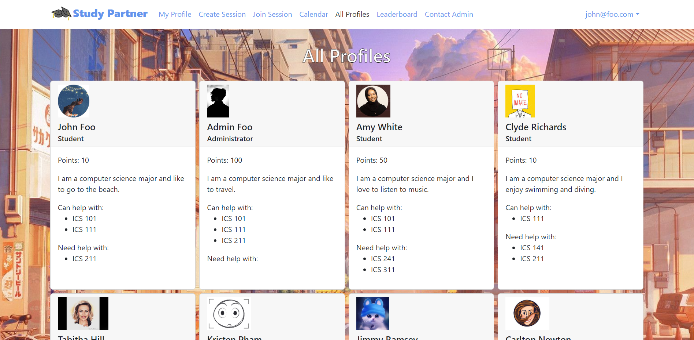
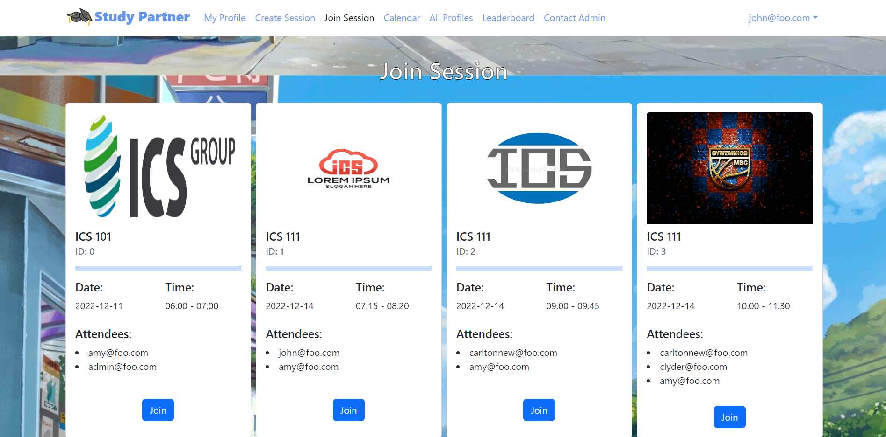
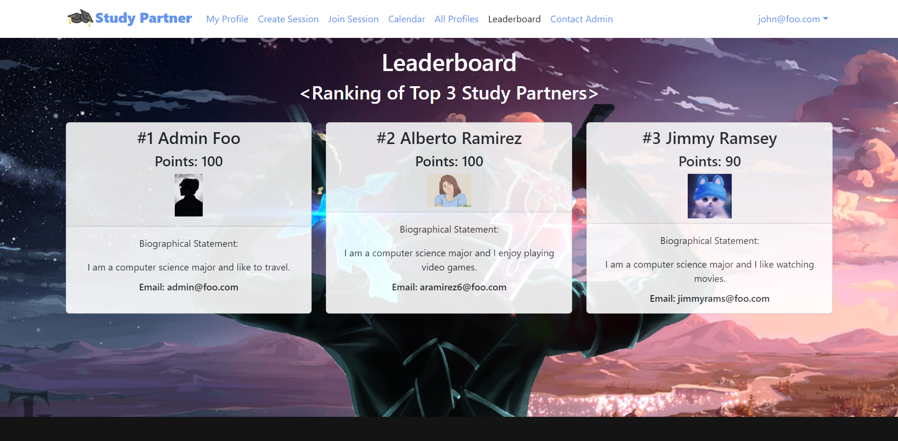
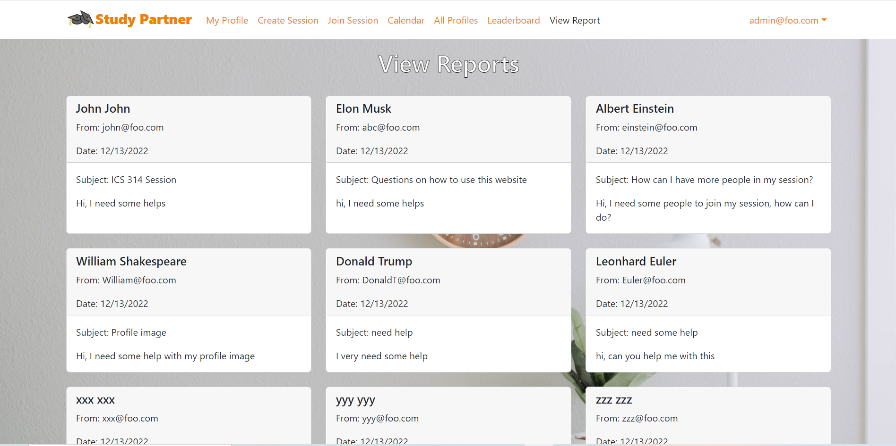
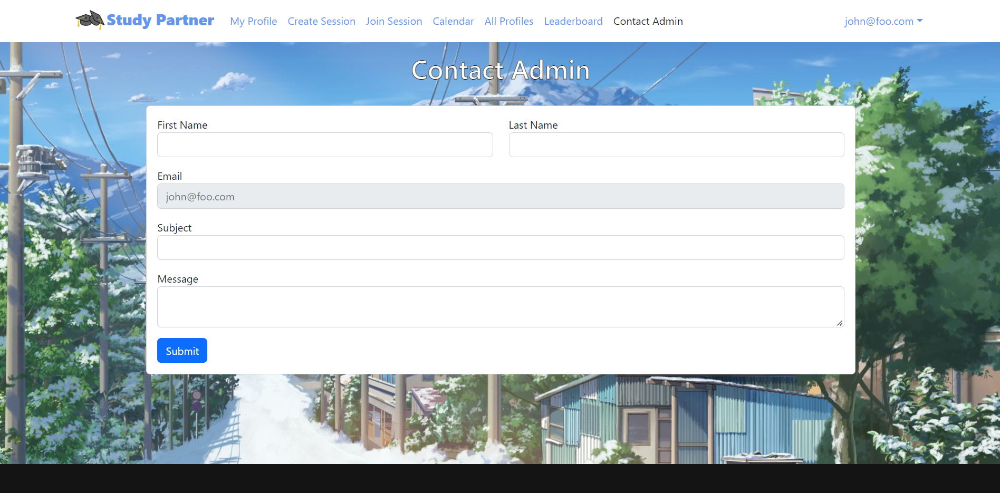
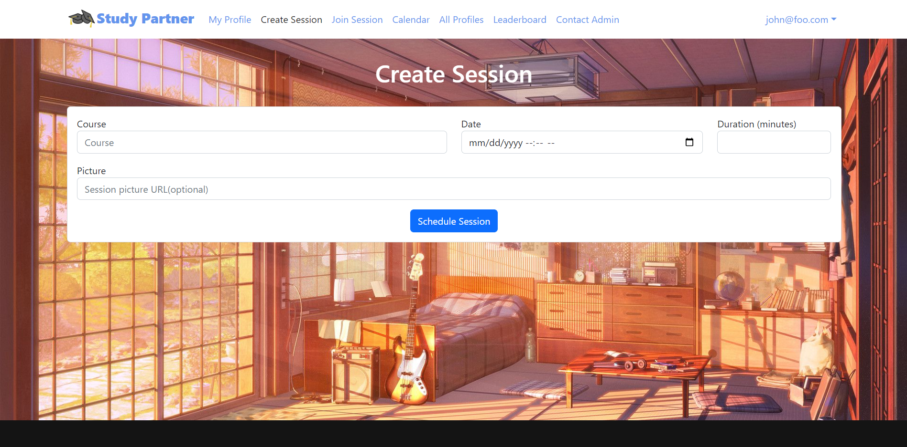
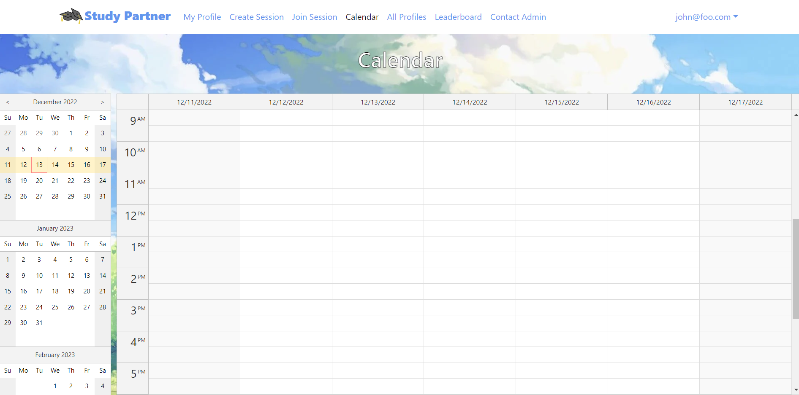

 
# Project Introduction
 
<figcaption align = "center"><b>Landing Page</b></figcaption>
 

There is a problem in UHM that ICS students often spend more time than they need on their homework and don’t learn the material as effectively as they could, because they study alone and do not leverage the power of face-to-face study groups with peer mentors. Therefore, we decided to create a solution for this issue as our final project for ICS 314 - a web application for University of Hawaii at Monoa (UHM) ICS students to self-organize face-to-face study groups around a course and/or specific homework or project topic.

The goals for Study Partner are:
- To encourage use of ICS space among ICS students
- To minimize risk of inappropriate encounters by requiring all meetings to occur in ICSpace.
- To encourage face-to-face interaction among ICS students.

<figcaption align = "center"><b>My Profile Page</b></figcaption>
 

Our approach to this problem is that students can register or log in the website using email. They are able to set up their profiles as well as look at other people's profiles. The profile enables each student to list courses they have taken and for which they are willing to attempt to provide help, and courses they are currently taking and for which they might need help. 

<figcaption align = "center"><b>All Profiles Page</b></figcaption>
 

2 styles of using Study Partner:
1. Individual: join a study session that you like to attend in the current day or in the future
2. Group: through "All Profiles" page contact people you would like to plan a session with or plan a group session with people you know

<figcaption align = "center"><b>Join Session Page</b></figcaption>
 

# My Contribution

  
  
  

In this project, I helped design and create the landing page. I designed all pages' (except home pages and log-in pages) backgrounds and headings.

<figcaption align = "center"><b>Create Session Page</b></figcaption>

In addition, I helped to design the Mongo database collection that contain all of the sessions' data and how to insert the proper data through the form in Create Session Page using Publication and Meteor method design. I also helped on creating Join Session page regarding to the card display, data extraction from the database, and fixed Mongo database issues, such as 
> - display attendee list in the cards.
> - separate the MakeCard function from Join Session to create MakeCard Component, update MakeCard Component to fix the following issues:
> > - fix can't display default session collection.
> > - enable join button to add current user's email into attendee array.
> > - fix adding same email to attendee array.

 

<figcaption align = "center"><b>Calendar Page</b></figcaption>

Lastly, I built the Calendar page which can display the current user's attended sessions by using an open-source DayPilot React calendar component. The calendar will display a weekly calendar on the week that the user is in. The user can also pick different weeks through the month picker.
 

# My Takeaways

Since I attempted Hawaii Code Challenge (HACC) 2022 using Meteor framework with MongoDB, this was not my first time doing a big project with a team using what I learned in ICS 314, but it is my second time of doing a big web application project with a team by using similar skills and it was a successful one as well! First of all, I was very grateful when we finished this project because in HACC we had team members unable to continue participate in the competition due to force majeure factors like sickness. Second, this is my first time truly use the power of agile project management in a team, specifically issue-driven project management through GitHub. We were able to divide, manage, and complete the reverent issues/tasks rather than trying to figure out and solve things along the way. In addition, I get more comfortable with Javascript, HTML, json, Meteor React framework, Mongo database. I also get a deeper understanding on these tools, web application design & development (like debugging using Eslint, console, and inspection of the HTML elements; user subscriptions; default data; server deployment), and fundamental software engineering skills (such as coding standards, open source software development, configuration management, and user interface frameworks)

You can learn more at the project home page: [Study Partner](https://study-partner.github.io/).
